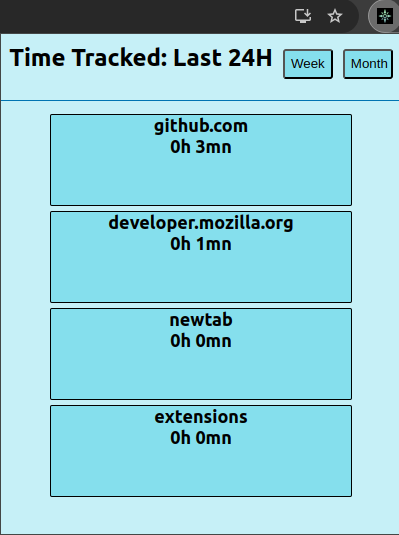

# TabTrackr

A chrome extension that tracks tab usage

<p align="center">
  
</p>

# Getting started
Open the console and run: 
  * In the server folder:
     ```
      npm install
    ```
     
     ```
        npm run dev
     ```

     
  *  In the client folder:
     ```
      npm install
      ```
     ```
        npm run dev
     ```
  * Go to chrome://extensions/ in the browser, and click 'load unpacked' in the top left. Then open the dist folder.
  * Turn the extension on and you should see the extension running

# Tech stack

* Client <br>
<picture></picture>
<picture></picture>
<picture></picture>

* Server <br>
<picture></picture>
<picture></picture>
<picture></picture>
<picture></picture>

# Contributors

  * Archie Maunder-Taylor [Github](https://github.com/a-rchi-e)
  * Paul Paumier Martinez [Github](https://github.com/nimbus4gh)
